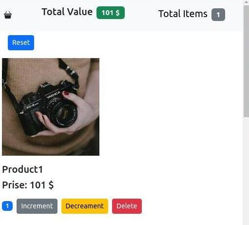

# SmartCart Manager

Welcome to **SmartCart Manager**, a modern React application designed to demonstrate the basics of building a dynamic and interactive product tracking system. This project showcases my React skills through clean design and responsive functionality.

---

## Live Demo

Check out the live demo of the app [here](https://nima-nourinejad.github.io/Counter-App/).

---

## Features

- **Dynamic Cart Management**: Adjust product quantities with increment, decrement, and reset options.
- **Real-Time Totals**: View the total number of items and their combined price instantly.
- **Engaging UI**: Displays product images, names, and prices in a clean, responsive layout.
- **Responsive Design**: The app adapts seamlessly across devices for a smooth user experience.

---

## Project Overview

**SmartCart Manager** is built using React and showcases essential concepts such as:

- Component-based architecture.
- State management for dynamic updates.
- Bootstrap integration for responsive styling.

The application includes:

- A navigation bar showing total items and their combined value.
- A list of products with individual controls for adjusting quantities.
- Real-time calculations displayed interactively.

---

## Screenshots

### Main Screen  

---

## Technologies Used

- **React**: For building the user interface.
- **Bootstrap**: For styling and responsive design.

---

## About This Project

This app serves as a demonstration of my ability to build React applications with dynamic functionality and clean user interfaces. While it may not be a full-fledged application for commercial use, it highlights key concepts such as state management, props, and reusable components.

---

## Learn More

Explore more about React and related technologies:

- [React Documentation](https://reactjs.org/)
- [Bootstrap Documentation](https://getbootstrap.com/)

---

Thank you for exploring **SmartCart Manager**! If you have feedback or ideas, feel free to reach out.

## Available Scripts

In the project directory, you can run:

### `npm start`

Runs the app in the development mode.\
Open [http://localhost:3000](http://localhost:3000) to view it in your browser.

The page will reload when you make changes.\
You may also see any lint errors in the console.

### `npm test`

Launches the test runner in the interactive watch mode.\
See the section about [running tests](https://facebook.github.io/create-react-app/docs/running-tests) for more information.

### `npm run build`

Builds the app for production to the `build` folder.\
It correctly bundles React in production mode and optimizes the build for the best performance.

The build is minified and the filenames include the hashes.\
Your app is ready to be deployed!